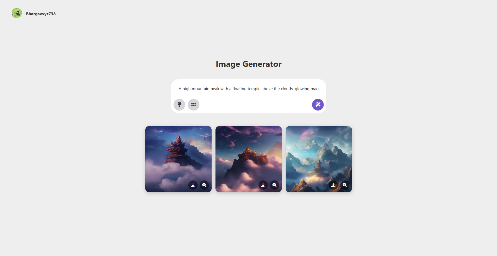

# AI Image Generator UI



This repository contains the open-source front-end for an AI-powered text-to-image generator. It is a clean, responsive, and user-friendly web application built with vanilla HTML, CSS, and JavaScript, designed to connect to any compatible image generation backend API.

## Live Demo

A live version of this UI is deployed and accessible here:

**[https://image-gen-flax.vercel.app](https://image-gen-flax.vercel.app)**

**Important:** This is a **UI-only** deployment. The application does not include a backend. When you open the link, you **must provide your own compatible backend API URL** when prompted for the application to function.

## About the Project

This project provides a standalone UI that allows users to generate images from text prompts. While the UI is fully open-source for anyone to use, modify, and learn from, the core image generation model it was designed for is a proprietary, fine-tuned model and is **not** included in this repository.

The interface is designed to be simple and intuitive, featuring a prompt gallery for inspiration, configurable grid sizes for generating multiple images at once, and easy-to-use actions for downloading or viewing the generated images.

### Key Features

-   **Responsive Design:** Works seamlessly on both desktop and mobile devices.
-   **Dynamic Image Grid:** Generate 1, 2, 3, or 4 images at once with an easy-to-use grid setting.
-   **Prompt Gallery:** A built-in modal with a list of creative prompts to inspire users.
-   **Robust Feedback:** Clear visual feedback with loading spinners for each image and descriptive error messages.
-   **Image Actions:** Easily download or zoom into any generated image.
-   **Dynamic Backend URL:** Prompts the user for their backend API endpoint on startup, making it easy to connect to your own server (e.g., a Google Colab instance exposed with ngrok).
-   **Zero Dependencies:** Built with pure vanilla JavaScript, HTML, and CSS (plus Font Awesome for icons).

## About the Backend Model (Not Open-Source)

The backend model that this UI was built to interface with is a custom, fine-tuned image generation model. While the model itself remains proprietary, here are some details about its architecture:

-   **Base Model:** It was built upon one of the smallest available Stable Diffusion pre-trained models. A popular and comparable base model is **[runwayml/stable-diffusion-v1-5](https://huggingface.co/runwayml/stable-diffusion-v1-5)** available on Hugging Face.
-   **Fine-Tuning:** The base model was extensively fine-tuned on a custom, high-quality dataset of over 1 million images to achieve its unique style and performance.

## Getting Started

To run this UI locally, you will need a running backend server that can handle image generation requests according to the API specification below.

### Prerequisites

-   A modern web browser (Chrome, Firefox, Safari, Edge).
-   A running backend API endpoint that is compatible with the [API Specification](#backend-api-specification).

### Installation & Usage

1.  **Clone the repository:**
    ```bash
    git clone https://github.com/Bhargavxyz738/image_gen.git
    cd image_gen
    ```

2.  **Open the UI:**
    Open the `index.html` file directly in your web browser.

3.  **Enter Your Backend API URL:**
    Upon loading, the application will prompt you to enter the URL for your backend API. This must be a full, valid URL starting with `https://` (e.g., an ngrok URL from a Google Colab notebook).

4.  **Start Generating!**
    -   Type a descriptive prompt into the input box.
    -   Use the💡 button to explore the Prompt Gallery for ideas.
    -   Use the ▦ button to select how many images you want to generate (1-4).
    -   Click the ✨ button to generate your images.

## Backend API Specification

To make this UI work with your own backend, you must implement an API endpoint that adheres to the following contract.

### Request

-   **Endpoint:** `[YOUR_BACKEND_URL]/generate`
-   **Method:** `POST`
-   **Headers:**
    -   `Content-Type: application/json`
    -   `ngrok-skip-browser-warning: true` (Recommended if using ngrok to avoid browser warnings)
-   **Body (JSON):**
    ```json
    {
      "prompt": "A sprawling cyberpunk city at night, neon lights...",
      "num_images": 4
    }
    ```

### Success Response (200 OK)

-   **Content-Type:** `application/json`
-   **Body (JSON):** The response must be a JSON object containing a single key, `images`, which is an array of base64-encoded image strings (without the `data:image/png;base64,` prefix).
    ```json
    {
      "images": [
        "iVBORw0KGgoAAAANSUhEUgAA...",
        "iVBORw0KGgoAAAANSUhEUgAA...",
        "..."
      ]
    }
    ```

### Adapting for Other Backend Models

If your backend API has a different request or response structure, you will need to modify the `generateImages` function in `script.js`. Specifically, you will need to update:
1.  The `body` of the `fetch` request to match your API's expected input.
2.  The response handling logic (`const data = await response.json(); const encodedImages = data.images;`) to correctly parse the image data from your API's response.

## A Note on Production Use

This application was developed primarily as a functional prototype to test and showcase our custom image generation model. As a result, the focus was on rapid development and core functionality. While the code is clean and works effectively for its intended purpose, some aspects may not adhere to rigorous production-level standards regarding scalability, error handling, or architectural patterns.

It serves as an excellent starting point for personal projects, learning, or as a template for a more robust application.

## Technologies Used

-   **HTML5**
-   **CSS3**
-   **Vanilla JavaScript**
-   **Font Awesome:** For icons.

## Contributing

Contributions are welcome! If you have suggestions for improving the UI, please feel free to fork the repository, make your changes, and open a pull request.

## License

This project is licensed under the MIT License. See the `LICENSE` file for more information.
## Author

This UI was created by **Bhargav** ([@Bhargavxyz738](https://github.com/Bhargavxyz738)).
